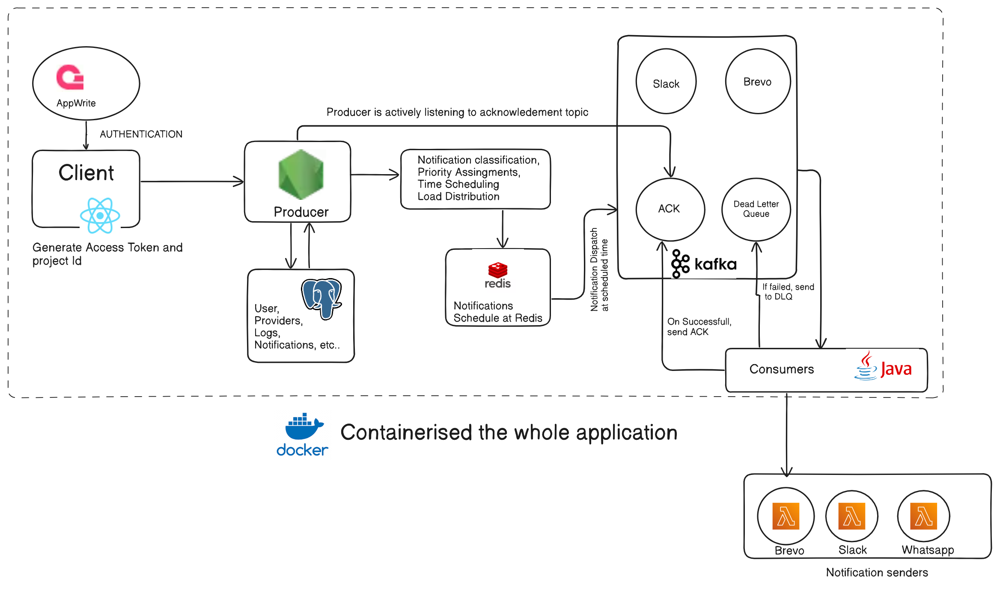
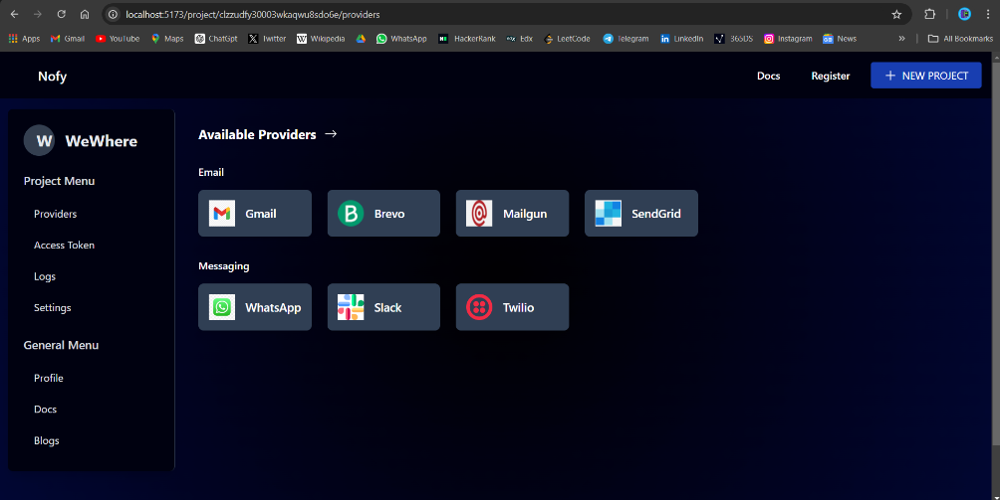

# Nofy - Notification Infrastructure

This project provides a robust, scalable notification system designed to handle large volumes of notifications across multiple channels, such as Slack, Email (Brevo), and WhatsApp. It includes key features such as  queuing, scheduling, and retry mechanisms to manage traffic surges and maintain high availability.

The application is containerized using Docker, making it portable and easy to deploy in various environments.

## Table of Contents
- [Overview](#overview)
- [Architecture](#architecture)
- [Components](#components)
- [Workflow](#workflow)
- [Setup and Installation](#setup-and-installation)
- [Technologies Used](#technologies-used)
- [License](#license)

## Overview
This notification infrastructure is designed to:
- Manage and distribute notifications based on priority and scheduling.
- Send notifications across various channels like Slack, Brevo (email), and WhatsApp.
- Support acknowledgment mechanisms to ensure reliable delivery and retry logic.
- Handle failure scenarios with Dead Letter Queues (DLQ) to prevent message loss.

## Architecture
The architecture consists of several key components as outlined in the pipeline diagram:

<!-- insert image -->
 


- **Client**: A frontend (built with React) that generates an access token and project ID using AppWrite for authentication.
- **Producer**: A Node.js service responsible for creating notifications and scheduling them in Redis.
- **Redis**: Used to manage and schedule notification tasks, allowing for delayed and scheduled delivery.
- **PostgreSQL**: Stores persistent data such as users, notification logs, providers, and other relevant information.
- **Kafka**: Acts as the main message broker to distribute notifications and handle acknowledgment. Supports ACKs and Dead Letter Queues (DLQ) to manage successful and failed notifications.
- **Consumers**: Java-based services that consume notifications and send them to various channels.
- **Notification Senders**: AWS Lambda functions(although currently is deployed in supabase edge function, but will migrate to lamda) that handle the final delivery of notifications to Slack, Brevo, and WhatsApp.

## Workflow
Here’s a detailed breakdown of the workflow illustrated in the diagram:

1. **Authentication**:
   - The client (React) authenticates users through AppWrite, which generates an access token and project ID for secure access.

2. **Notification Creation**:
   - The client's servers send notification requests to the **Producer**.
   - The **Producer** validates the request, classifies notifications, assigns priorities, and schedules notifications using Redis.
   - Notifications are also stored in PostgreSQL for logging and tracking purposes.

3. **Scheduling and Load Distribution**:
   - Redis handles the notification scheduling. Notifications are dispatched from Redis to Kafka at the designated time.

4. **Message Queue and Acknowledgment**:
   - **Kafka** is used as the main message broker. The Producer listens to Kafka’s acknowledgment topic to manage notification delivery.
   - Notifications are distributed from Kafka to consumers based on availability and priority.

5. **Notification Dispatch and Dead Letter Queue**:
   - **Consumers** (Java services) listen to Kafka for notification messages.
   - On receiving a message, the consumer tries to send it to the appropriate channel (Slack, Brevo, WhatsApp).
   - Upon successful delivery, an acknowledgment (ACK) is sent back to Kafka.
   - If delivery fails, the notification is sent to the **Dead Letter Queue** (DLQ) for retry or further analysis.

6. **Channel-Specific Delivery**:
   - AWS Lambda functions handle the final dispatch to each channel:
     - **Slack**: Sends notifications via Slack API.
     - **Brevo**: Sends emails through Brevo.
     - **WhatsApp**: Sends messages through WhatsApp’s API.


<!-- preview -->


## Setup and Installation
To set up this project, follow these steps:

1. **Docker Setup**: Ensure Docker is installed and running. Build and run the Docker container:
   ```bash
   docker-compose up --build
   ```
2. **AppWrite Configuration**: Set up an AppWrite project and configure the frontend to generate access tokens.
3. **Redis Configuration**: Update the Redis configuration in the Producer  services.
4. **PostgreSQL Setup**: Create a PostgreSQL database and update the connection details in the Producer services.
5. **Kafka Configuration**: Update the Kafka configuration in the Producer and Consumer services.
6. **AWS Lambda Functions**: Deploy the Lambda functions for Slack, Brevo, and WhatsApp.
7. **Supabase Edge Functions**: Deploy the edge functions for Slack, Brevo, and WhatsApp.
8. **Run the Services**: Start the Producer and Consumer services to begin sending notifications.


##Technologies Used
- **Frontend**: React
- **Backend**: Node.js, Java
- **Databases**: PostgreSQL, Redis
- **Message Broker**: Kafka
- **Serverless**: AWS Lambda, Supabase Edge Functions
- **Containerization**: Docker
- **Authentication**: AppWrite


